<h1 align="center">🔌 Snet.Iot.Daq</h1>

<p align="center">
  
</p>

<p align="center">
  <b>Open source · Free · Plugin-based · Industrial IoT data acquisition tool</b>
</p>

<p align="center">
  
  
  
  
  
  
</p>

<p align="center">
  <a href="https://snet.cn"><b>🌐 Official Website</b></a> ·
  <a href="https://github.com/shunnet/Daq"><b>📦 GitHub</b></a> ·
  <a href="https://github.com/shunnet/Daq/releases"><b>📥 Download</b></a> ·
  <a href="https://github.com/shunnet/Debug"><b>🔧 Debug Tool</b></a> ·
  <a href="https://Snet.cn/YJybu"><b>🎬 Demo Video</b></a>
</p>

<p align="center">
  English | 📖 <a href="README.md"><b>简体中文</b></a>
</p>

## ✨ About

**Snet.Iot.Daq** is a plugin-based data acquisition tool built on the **Snet.cn industrial communication library**, purpose-built for industrial device data collection.

```
┌────────────────────────────────────────┐
│  Snet.Iot.Daq (WPF desktop / Windows)   │  ← UI layer: MVVM + modern interface
├────────────────────────────────────────┤
│  Snet.Iot.Daq.Web (Web app / Linux)     │  ← UI layer: Blazor Server, browser access
├────────────────────────────────────────┤
│  Snet.Iot.Daq.Core (class library)      │  ← Core layer: business logic / models / services
├────────────────────────────────────────┤
│  Snet.cn industrial comm. library       │  ← Foundation: plugin framework / protocols / utilities
└────────────────────────────────────────┘
```

> 💡 The Core layer has no WPF dependency — the desktop edition (Windows) and the cross-platform Web edition (Linux / ARM64) share the same core business logic.

## 🚀 Features

| Module | Description |
|------|------|
| 🔌 **Plugin Hot-Plug** | Load / unload DAQ / MQ plugins at runtime without restart; same-name plugins support hot update |
| 📡 **OPC UA Server** | Built-in OPC UA Server with authentication, certificates, address space management and persistent subscriptions |
| 📨 **MQTT Broker** | Built-in MQTT broker with client management, authentication and max-connection control |
| 🌐 **WebAPI Service** | Built-in HTTP service (start/stop via WAOn / WAOff) for external system data ingestion |
| 📊 **Real-time Charts** | ScottPlot multi-curve real-time charts with skin switching and historical data |
| 🖥️ **System Monitoring** | Real-time CPU / GPU / RAM dashboards (LibreHardwareMonitor + WMI dual-channel) |
| 🎯 **Byte-Level Parsing** | Visual byte / bit / encoding / data-format configurator for custom protocol parsing |
| 📦 **NuGet Plugin Market** | Browse, download and one-click install Snet ecosystem plugins online |
| 🔢 **Auto Batching** | Smartly merges scattered addresses into batched reads to reduce communication overhead |
| ⚡ **Device Soft Start** | Starts collection automatically on launch — no manual intervention |
| 🔔 **System Tray** | Run minimized in the background, start/stop devices from the tray menu, single-instance guard |
| 🌐 **i18n / 🌓 Themes** | Chinese / English switching · dark / light themes, charts follow the skin |
| 🌐 **Cross-platform Web** | Blazor Server browser access, shares Core with the desktop edition, deploys on Linux x64 / ARM64 |

### 🎯 Use Cases

🏭 Industrial automation data collection · 🔧 PLC / device monitoring systems · 🌐 IoT edge acquisition gateways · 📡 OPC UA / MQTT data relay · 🔬 Custom-protocol device integration

## 🔌 Plugin System

The plugin engine (collectible `AssemblyLoadContext` + streaming loading) is provided by the **Snet.Core** package; this application handles plugin management and orchestration.

### 🔄 Load / Unload Flow

```
Upload ZIP plugin package → auto-extract to plugin directory → create collectible AssemblyLoadContext
→ stream-load assemblies → scan & instantiate IDaq / IMq interfaces → register into IOC container → start collection
```

```
Stop collection → release plugin instance (IAsyncDisposable) → remove IOC registration
→ unload AssemblyLoadContext → GC collect → delete plugin files
```

> 🔁 **Hot Update**: uploading a plugin package with the same name automatically performs "stop device → update → restore running state" — no restart needed.

### 🛠️ Plugin Development

1. Create a .NET class library project and add the NuGet package `Snet.Core` (provides the plugin engine and the `IDaq` / `IMq` interfaces, located in the `Snet.Model.@interface` namespace)
2. Implement the interface methods (`OnAsync`, `OffAsync`, `ReadAsync`, `WriteAsync`, `GetStatusAsync`, etc.)
3. Package the build output directory into a **ZIP** file
4. Upload the ZIP on the "Plugin Settings" page of the app — it loads automatically

> 🤖 **AI-assisted development**: try [Snet.SKILLS](https://github.com/shunnet/SKILLS) — an AI skills collection tailored to the SNET architecture that accelerates plugin development.

## 🌐 Cross-platform Web Edition (Snet.Iot.Daq.Web)

The **Blazor Server Web edition**, sharing all business capabilities of `Snet.Iot.Daq.Core` with the desktop edition — just open it in a browser, no client installation required.

- **Platforms**: Windows / Linux x64 / Linux ARM64 (Raspberry Pi, Phytium, Kunpeng, etc.)
- **UI**: cyan glassmorphism design, dark / light themes, Chinese / English switching, responsive layout for phones and tablets
- **Feature parity**: plugin hot-plug & hot update, OPC UA server, MQTT broker, WebAPI, auto batching, device soft start
- **Multi-user & security**: two-tier roles — Administrator / Regular User (read-only), failed-login lockout, operation log audit
- **Differences**: no ScottPlot charts, system tray or GPU monitoring (desktop-only features)

### 🐳 Docker Deployment (recommended)

```bash
git clone https://github.com/shunnet/Daq.git && cd Daq
docker compose -f Snet.Iot.Daq.Web/docker-compose.yml up -d --build
# Open http://<server-ip>:5051 in a browser
```

Multi-arch images (linux/amd64 + linux/arm64) are built automatically by GitHub Actions and pushed to `ghcr.io`.

### 🐧 Ubuntu Bare-metal Deployment

```bash
sudo bash Snet.Iot.Daq.Web/deploy/ubuntu-deploy.sh          # installs runtime → publishes → systemd service
sudo bash Snet.Iot.Daq.Web/deploy/ubuntu-deploy.sh --port 8080 --data /srv/snet-daq
```

### 📦 GitHub Actions Multi-platform Packaging

Pushing a `v*` tag automatically produces **linux-x64 / linux-arm64 / win-x64** release packages (with the systemd deployment script) plus **ghcr.io dual-arch Docker images**, and publishes them to [GitHub Releases](https://github.com/shunnet/Daq/releases).

📄 For full deployment details (data persistence / ports / hardening), see [Snet.Iot.Daq.Web/README.DEPLOY.md](Snet.Iot.Daq.Web/README.DEPLOY.md).

## 📦 Installation & Usage (Desktop Edition)

### 📋 Requirements

| Component | Requirement |
|------|------|
| 🖥️ **OS** | Windows 10 / 11 (x64) |
| 🔧 **.NET Runtime** | .NET 10.0 Desktop Runtime |
| 🛠️ **Build Tools** | Visual Studio 2022+ (to compile) |
| 💾 **Disk Space** | ≥ 200 MB |

### 📥 1️⃣ Clone

```bash
git clone https://github.com/shunnet/Daq.git
cd Daq
```

### 🔨 2️⃣ Build

Open `Snet.Iot.Daq.sln` with **Visual Studio 2022** or later, then build Debug or Release.

### ▶️ 3️⃣ Run

Launch `Snet.Iot.Daq.exe` from the output directory after building.

> 💡 **Don't want to build?** Download the pre-built ZIP from [GitHub Releases](https://github.com/shunnet/Daq/releases) and unzip to run.

## 👥 Accounts & Permissions (Web Edition Only)

> 💡 The desktop edition (WPF) is single-machine use with no login or permission system; the permission model below applies to the **cross-platform Web edition (Snet.Iot.Daq.Web)** only.

The system uses a two-tier permission model: Administrator / Regular User.

| Role | Permissions |
|------|------|
| **Administrator** | Full access: plugin browsing & settings, address management, project configuration, collection start/stop, WebApi / auto-pack settings, server management, user management |
| **Regular User** | **Read-only**: can only view the Console (device status, system monitoring, run logs) — no operation buttons |

**Default administrator account**: `snet` / `123456`

**Password change on first login** (enforced by the system):

1. Sign in with `snet` / `123456` — the system automatically enters the password change page
2. Enter the current password `123456`, a new password (at least 6 characters) and confirm it
3. Save, then sign in again with the new password

> ⚠️ Change the default password immediately after production deployment; regular users are created by administrators on the "User Management" page.

## 🖥️ Screenshots

### 🖥️ Desktop Edition (WPF / Windows)

<p align="center">
  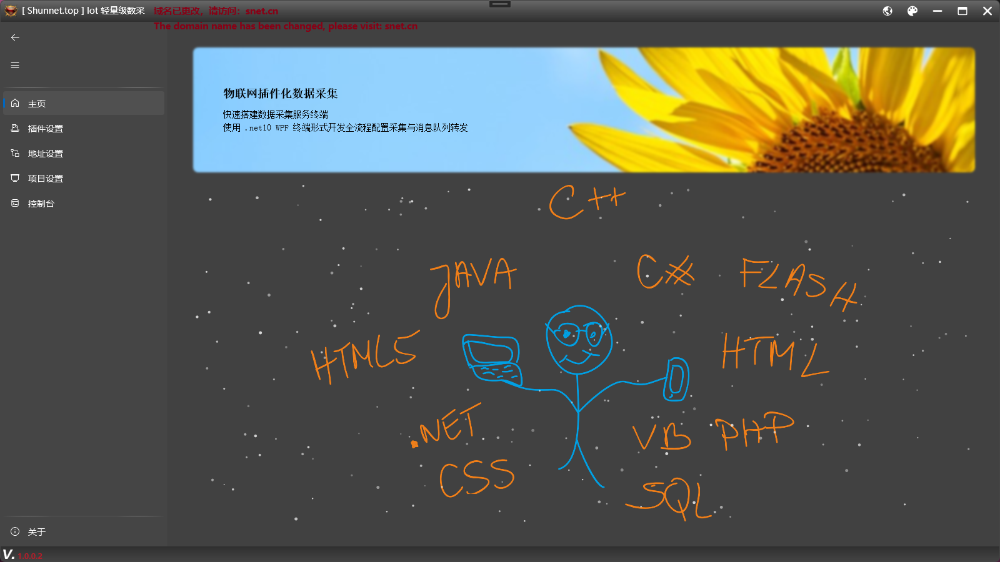
  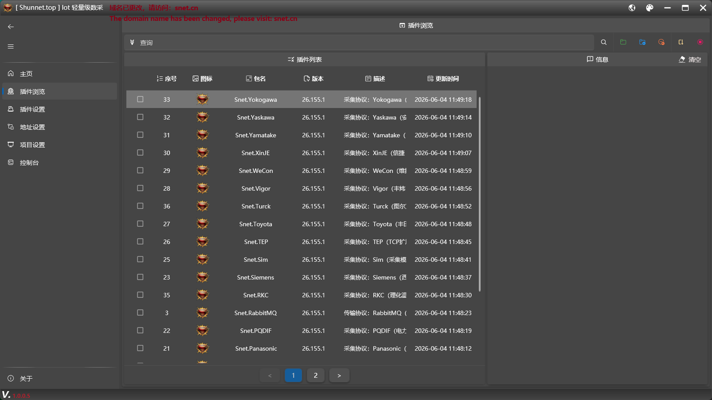
  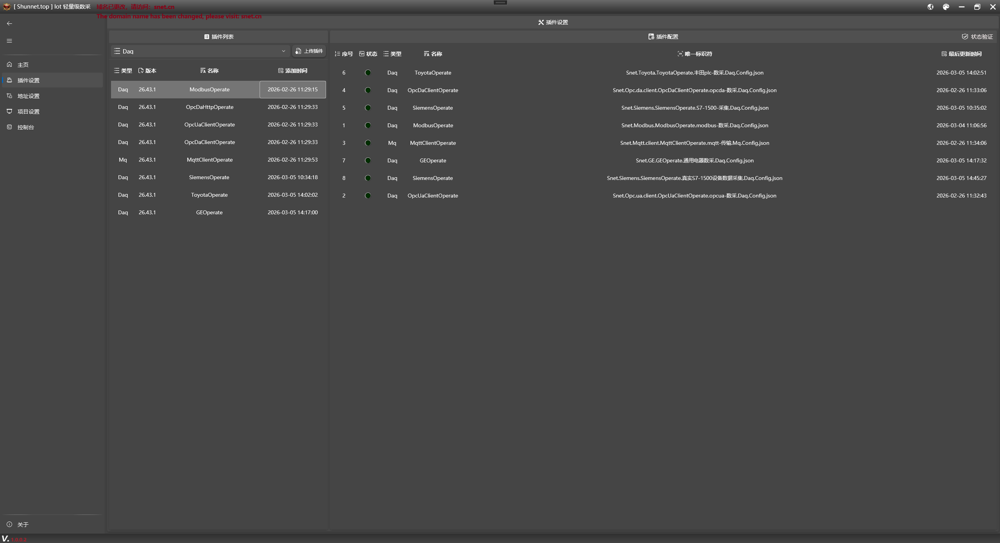
  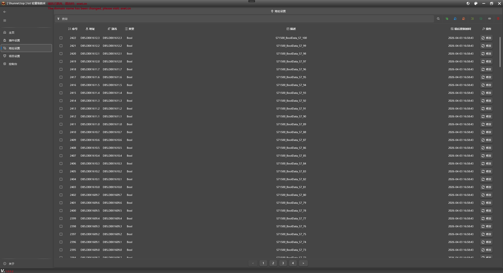
  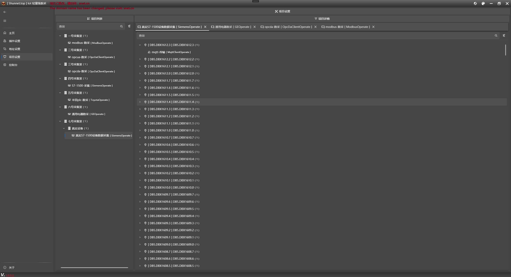
  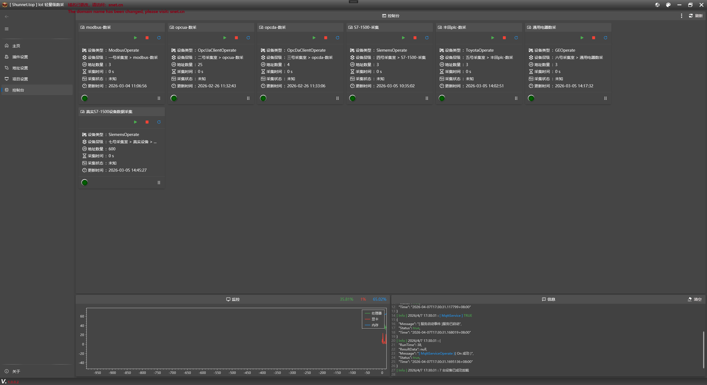
  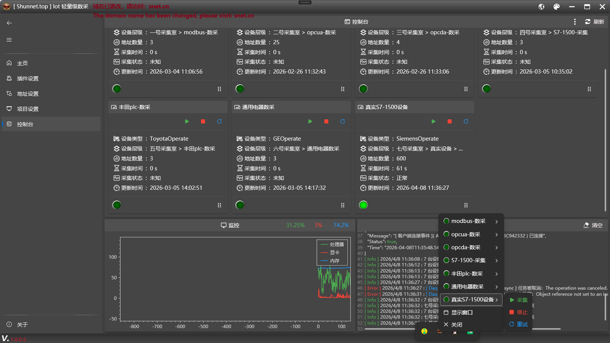
</p>

### 🌐 Web Edition (browser access)

<p align="center">
  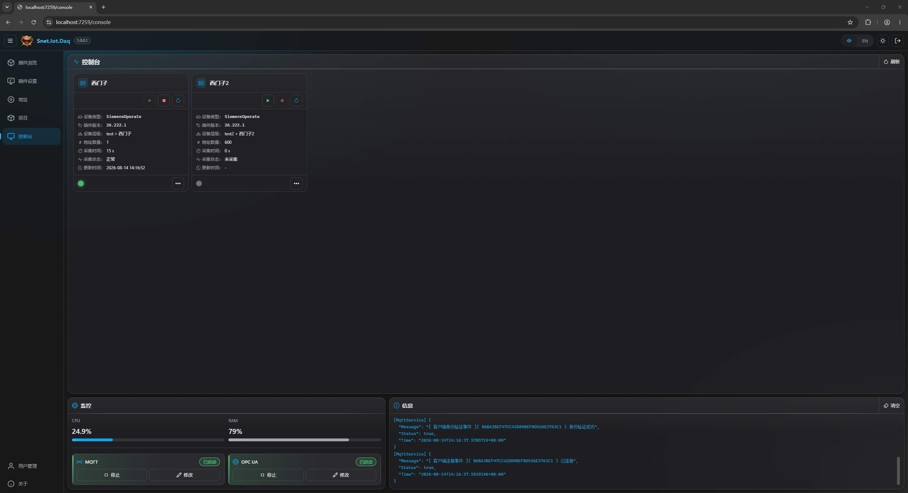
  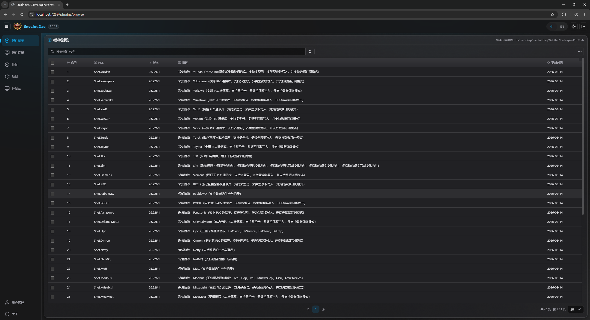
  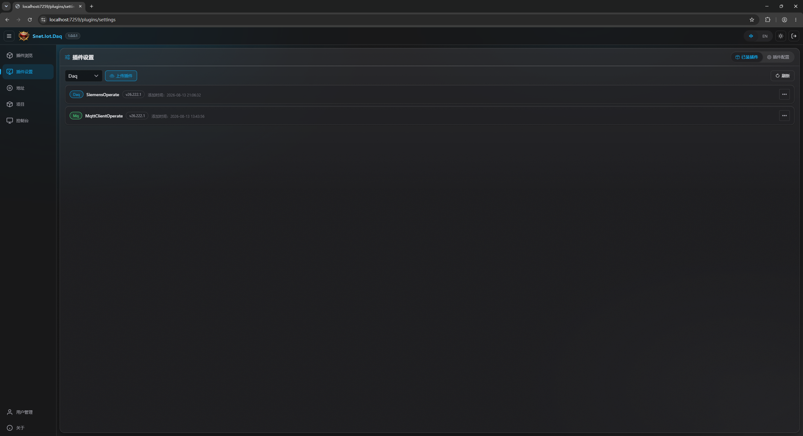
  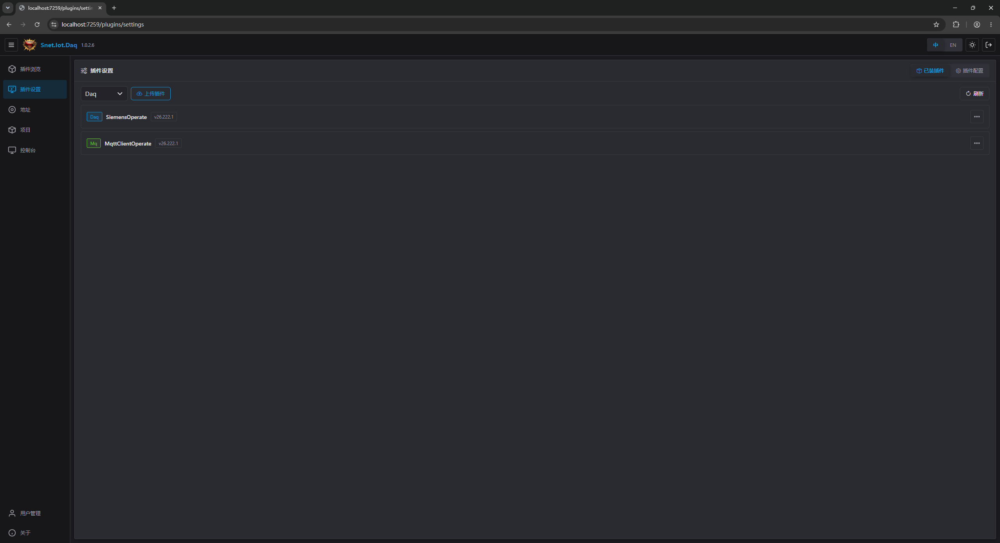
  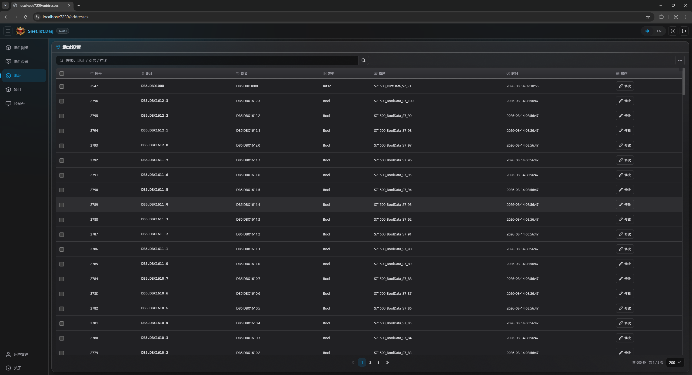
  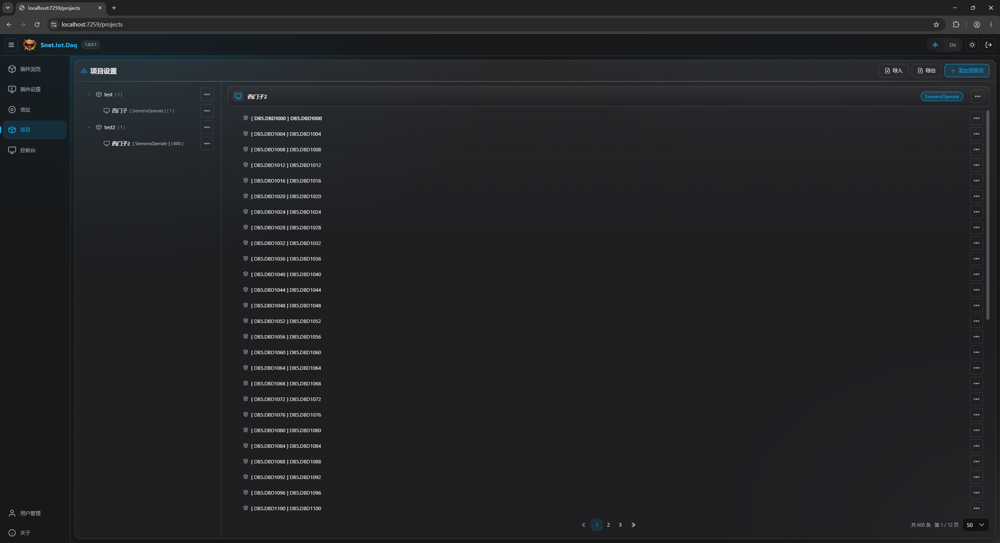
  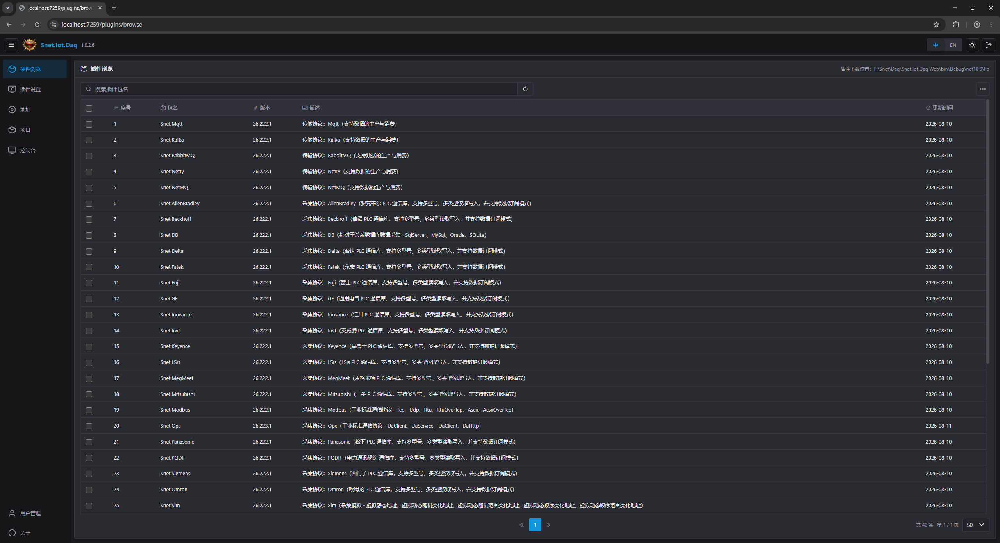
  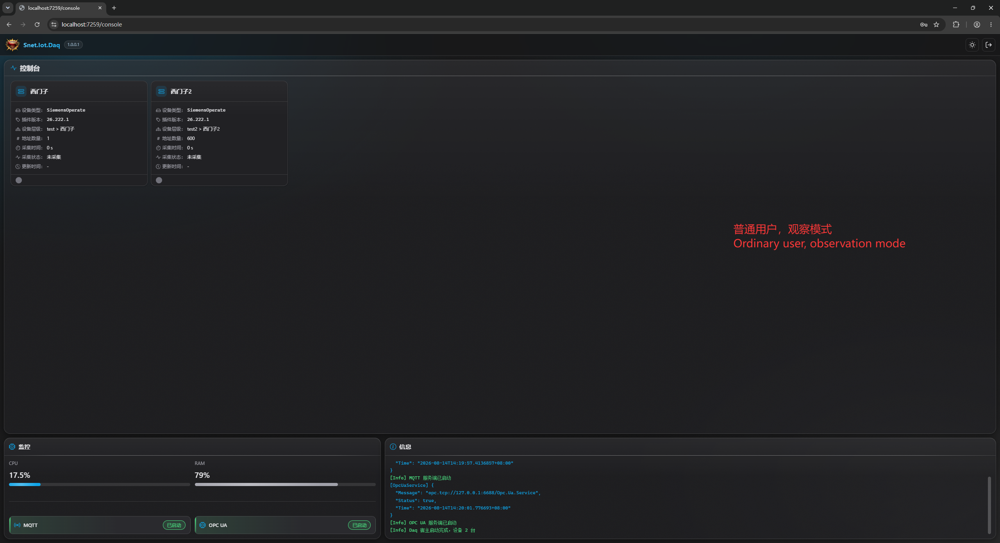
</p>

## 📚 Resources & Community

| Channel | Link |
|------|------|
| 🎬 **Demo Video** | [Watch now](https://Snet.cn/YJybu) |
| 🌐 **Official Website** | [snet.cn](https://snet.cn) |
| 📦 **NuGet Plugin Market** | Browse in-app on the "Plugin Settings" page |
| 🐛 **Issues** | [GitHub Issues](https://github.com/shunnet/Daq/issues) — report bugs or feature suggestions |
| 💬 **QQ Group** | [Join group](https://qm.qq.com/q/gPjrD9wGty) — technical discussion and Q&A |
| ⭐ **Star** | If this project helps you, please give it a Star ❤️ |

## 🙏 Acknowledgements

- [Snet.cn](https://snet.cn) — Industrial communication library
- [Snet.Windows.Controls](https://github.com/shunnet/WpfMUI) — WPF control library
- [LibreHardwareMonitor](https://github.com/LibreHardwareMonitor/LibreHardwareMonitor) — Hardware monitoring
- [ScottPlot](https://scottplot.net) — Scientific charting library
- [sqlite-net](https://github.com/praeclarum/sqlite-net) — Lightweight database

## 📜 License


This project is licensed under the **MIT** License — free to use, modify and distribute.

📄 Read the [LICENSE](LICENSE) file for the full terms.

> ⚠️ The software is provided "as is"; the author takes no responsibility for the consequences of use.

## 📈 Star History

<a href="https://www.star-history.com/?repos=shunnet%2FDaq&type=date&legend=bottom-right">
 <picture>
   <source media="(prefers-color-scheme: dark)" srcset="https://api.star-history.com/chart?repos=shunnet/Daq&type=date&theme=dark&legend=bottom-right&sealed_token=3Tft7-uvG5B6fob8INAvqe9armRuIkXlOveR3cnY2kXGwaJMMtYWOyq45srnSCO-Dq6_0dPyepq-b8O_4fMB87CqYCIZdawTTa_JHyS2oahHiDr0o_2NTA"/>
   <source media="(prefers-color-scheme: light)" srcset="https://api.star-history.com/chart?repos=shunnet/Daq&type=date&legend=bottom-right&sealed_token=3Tft7-uvG5B6fob8INAvqe9armRuIkXlOveR3cnY2kXGwaJMMtYWOyq45srnSCO-Dq6_0dPyepq-b8O_4fMB87CqYCIZdawTTa_JHyS2oahHiDr0o_2NTA"/>
   
 </picture>
</a>
