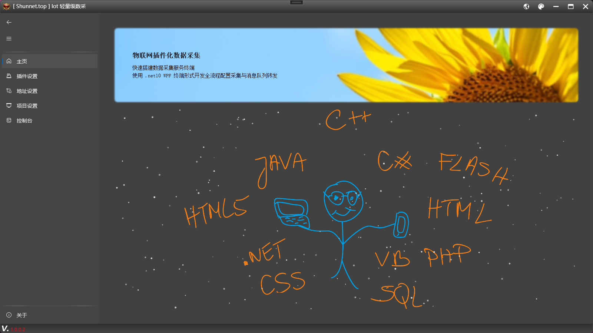
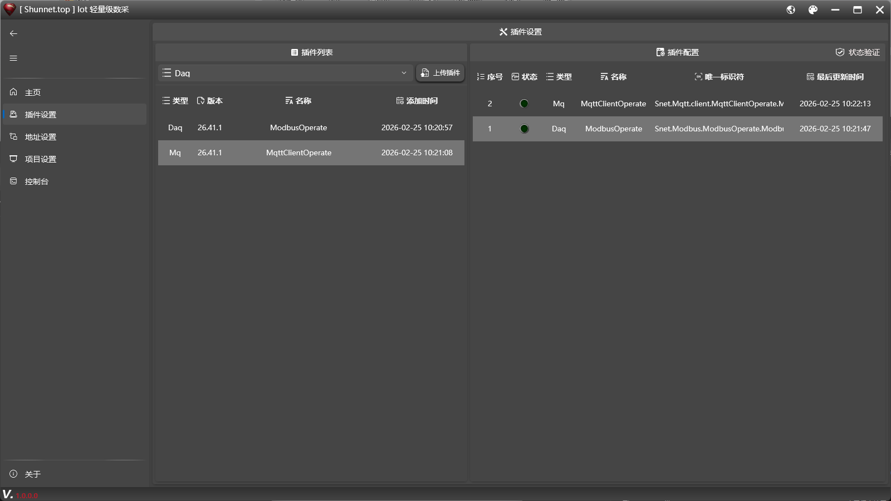
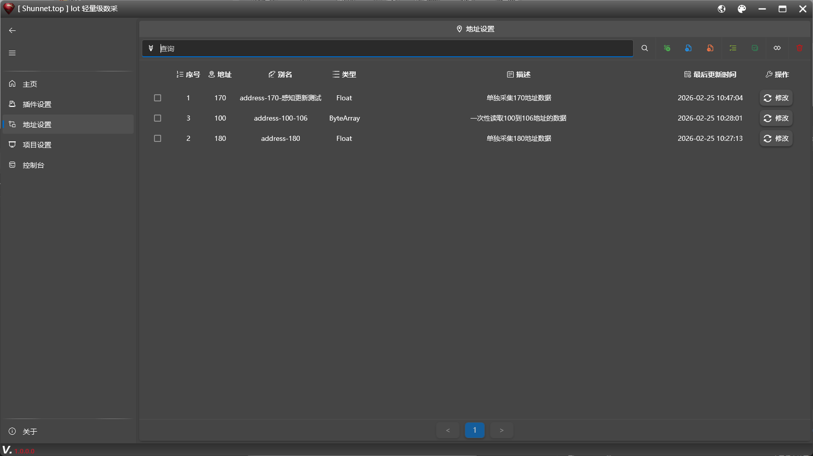
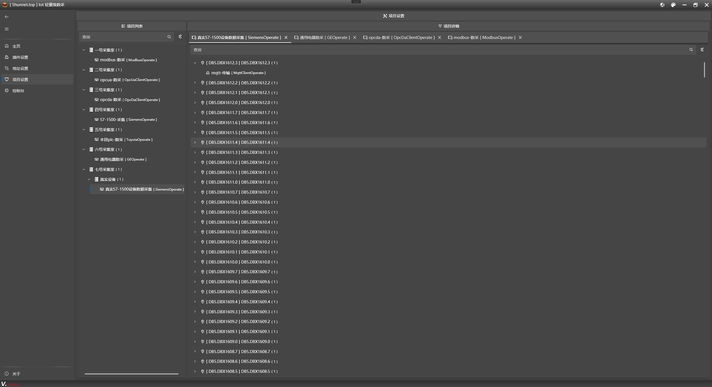
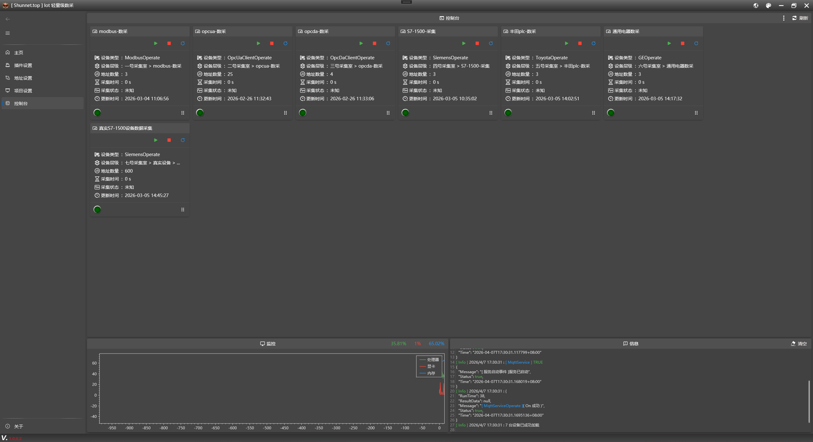
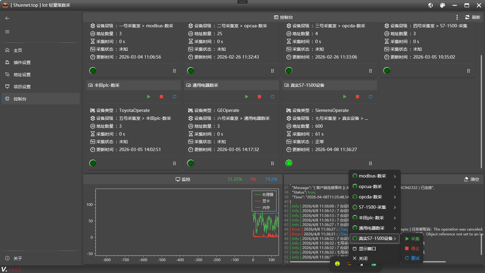

<h1 align="center">Daq</h1>

<p align="center">
  
</p>

<p align="center">
  <b>开源 · 免费 · 插件化 · 工业物联网数据采集工具</b>
</p>

<p align="center">

  
  
  
  

</p>

<p align="center">
  基于插件架构的工业物联网（IIoT）数据采集与传输工具，内置 Sqlite 数据库，实现开箱即用的数据采集解决方案。
</p>

<p align="center">
  <a href="https://shunnet.top"><b>🌐 官方网站</b></a> ·
  <a href="https://github.com/shunnet/Daq"><b>📦 GitHub</b></a> ·
  <a href="https://Shunnet.top/YJybu"><b>🎬 演示视频</b></a>
</p>

## ✨ 项目介绍

Snet.Iot.Daq 是依托 **Shunnet.top 工业通信库** 开发的插件化采集工具，专为工业设备数据采集场景设计。

支持：

- 多设备并发采集
- 字节级协议解析
- 插件扩展架构
- 点位映射与存储
- 高性能稳定运行

适用于：

- 工业自动化
- PLC 数据采集
- 设备监控系统
- IoT 边缘采集网关
- 自定义协议设备

运行环境：

- 工业现场
- 边缘计算设备
- Windows 服务器


## 🚀 核心特性

- ✔ 完全开源免费（MIT License）
- ✔ 插件化架构，支持无限扩展
- ✔ 内置 Sqlite 轻量级数据库
- ✔ 支持多设备并发采集
- ✔ 支持字节级协议解析
- ✔ 支持自定义点位映射
- ✔ 高性能低资源占用
- ✔ 开箱即用
- ✔ 支持长期稳定运行

## ⚡ 性能特点

- ✔ 极低 CPU 占用
- ✔ 极低内存占用
- ✔ 支持高频采集
- ✔ 支持 24/7 长期运行
- ✔ 工业级稳定性


## 🖥️ 界面

<p align="center">
  
</p>

<p align="center">
  
</p>

<p align="center">
  
</p>

<p align="center">
  
</p>

<p align="center">
  
</p>

<p align="center">
  
</p>

## 📦 安装与使用

### 1️⃣克隆仓库

``` bash
git clone https://github.com/shunnet/Daq.git
cd Daq
```

### 2️⃣ 编译项目

使用 **Visual Studio 2022** 或更高版本打开：

`Snet.Iot.Daq.sln`

选择 Debug 或 Release 构建。

### 3️⃣ 运行程序

构建完成后，在输出目录中找到 `Snet.Iot.Daq.exe`，双击运行即可启动。


## 🙏 致谢

- [Shunnet.top](https://shunnet.top)
- [WpfMUI](https://github.com/shunnet/WpfMUI)
- [LibreHardwareMonitor](https://github.com/LibreHardwareMonitor/LibreHardwareMonitor)
- [scottplot.net](https://scottplot.net)
- [sqlite-net](https://github.com/praeclarum/sqlite-net)


## 🎬 查阅

👉 [点击跳转](https://Shunnet.top/YJybu)  


## 📜 License

  

本项目基于 **MIT** 开源。  
请阅读 [LICENSE](LICENSE) 获取完整条款。  
⚠️ 软件按 “原样” 提供，作者不对使用后果承担责任。  


